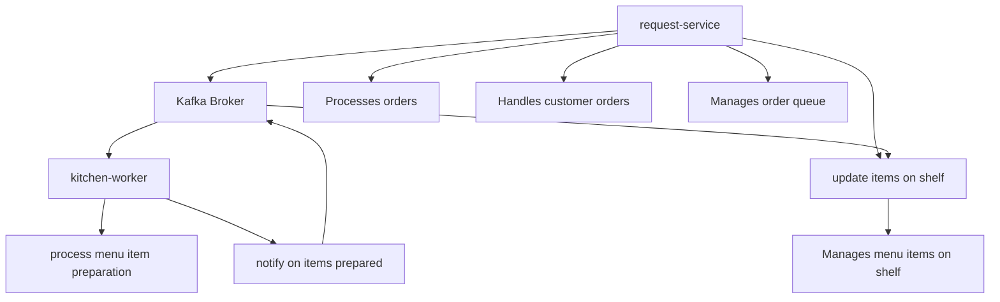
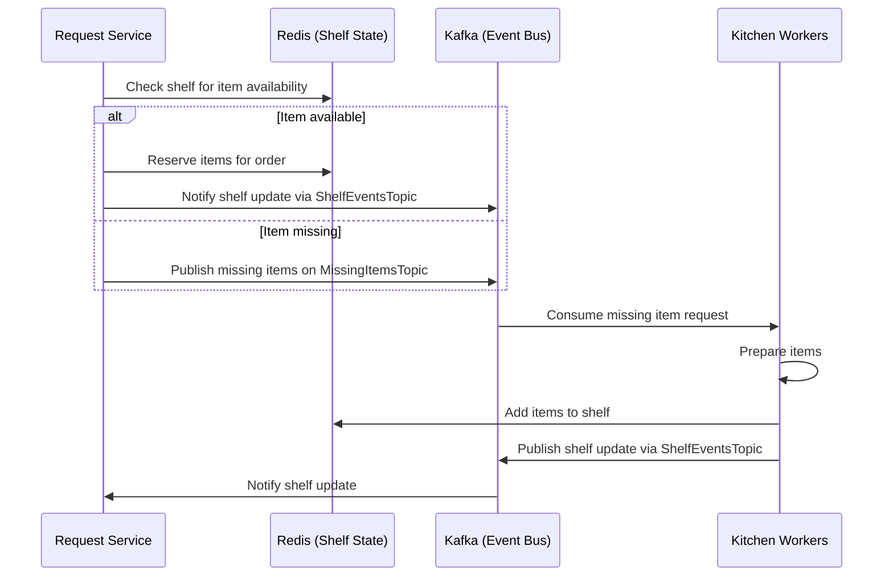

# Burger Shop Project

This project simulates a burger shop operation with two main components: kitchen-worker and restaurant-requests.

## Project Structure

## Components

1. **kitchen-worker**: This component is responsible for:
   - Processing incoming orders
   - Preparing burgers and other menu items

2. **request-service**: This component handles:
   - Receiving customer orders
   - Managing the order queue
   - Communicating with the kitchen-worker

3. **kitchen-shelf**: This component handles:
   - Managing the restaurant shelf

## Getting Started

[Add instructions on how to set up and run the project]

## 

## Contributing

[Add guidelines for contributing to the project]

## License

[Specify the license under which this project is released]
