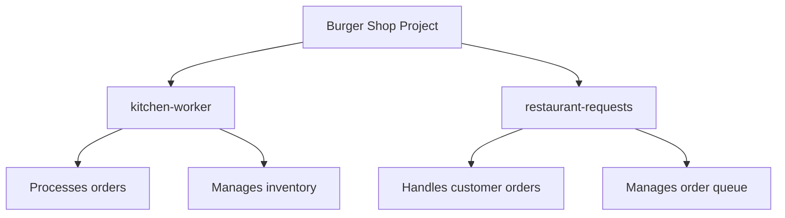

# Burger Shop Project

This project simulates a burger shop operation with two main components: kitchen-worker and restaurant-requests.

## Project Structure

## Components

1. **kitchen-worker**: This component is responsible for:
   - Processing incoming orders
   - Managing the kitchen inventory
   - Preparing burgers and other menu items

2. **restaurant-requests**: This component handles:
   - Receiving customer orders
   - Managing the order queue
   - Communicating with the kitchen-worker

## Getting Started

[Add instructions on how to set up and run the project]

## Contributing

[Add guidelines for contributing to the project]

## License

[Specify the license under which this project is released]
